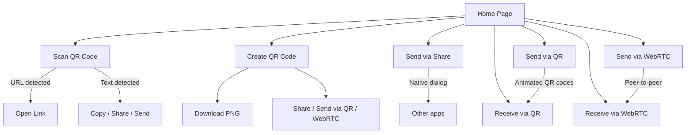
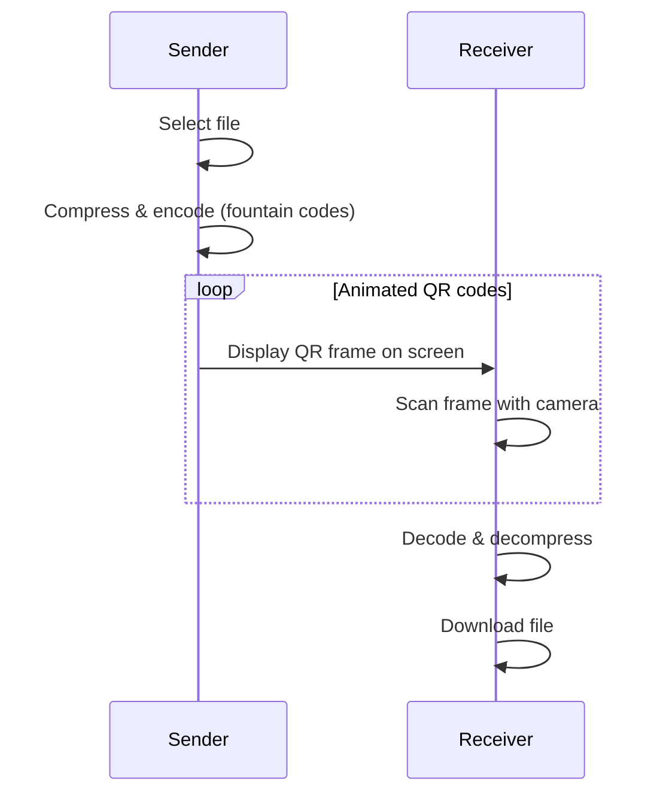
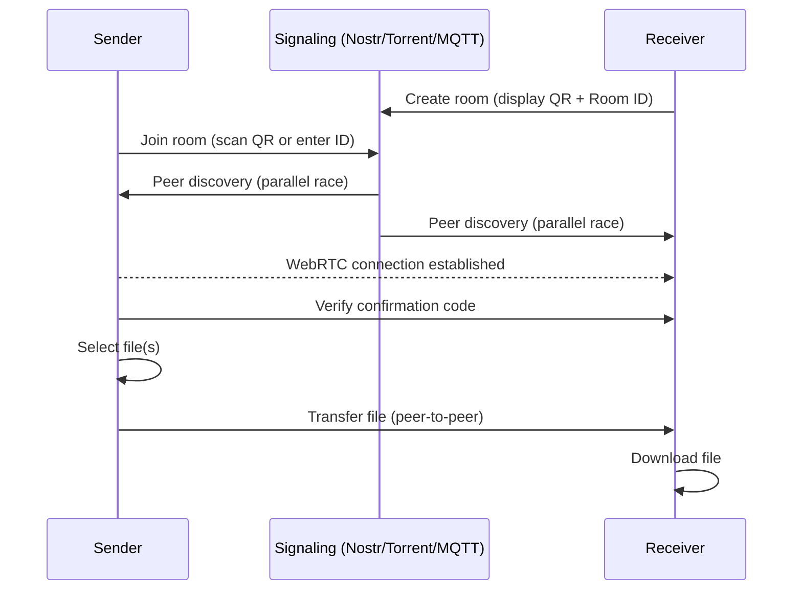

# QRShare — User Guide

## What is QRShare?

QRShare is a web application that lets you:

1. **Scan a QR code** using your device's camera
2. **Create a QR code** from any text or web address
3. **Share a file** to any app via the native share dialog
4. **Send a file** to another device via animated QR codes (no internet required)
5. **Send a file** peer-to-peer via WebRTC (internet required)

The application runs directly in your browser with nothing to install. It is available at:
**https://s-celles.github.io/QRShare/**

---

## Home Page

When you open the application, you see two sections:

### QR Utilities (top)

Two buttons for everyday QR tools:

- **Scan QR Code** — Read a QR code with your camera
- **Create QR Code** — Generate your own QR code

### File Transfer (bottom)

Five buttons for transferring files between devices:

- **Send (Share)** — Share files via the native share dialog (messaging, email, cloud storage, etc.)
- **Send (QR)** — Send a file via animated QR codes
- **Receive (QR)** — Receive a file by scanning animated QR codes
- **Send (WebRTC)** — Send a file peer-to-peer over the network
- **Receive (WebRTC)** — Receive a file peer-to-peer over the network

---

## Scanning a QR Code

1. Tap **Scan QR Code**
2. Tap **Start Scanning** — your browser will ask for camera permission
3. Point the camera at a QR code
4. The content is displayed automatically:
   - If it is a web address, it appears as a clickable link
   - Otherwise, the text is shown and you can copy it with the **Copy to Clipboard** button
5. You can scan multiple QR codes in a row without stopping
6. Tap **Stop** to turn off the camera

**Displayed information**: active camera name, resolution, detected code type. If you have multiple cameras, a dropdown lets you choose which one to use.

---

## Creating a QR Code

1. Tap **Create QR Code**
2. Type your text or paste a web address into the text area
3. The QR code is generated instantly and updates with every change
4. Adjust the parameters if needed:
   - **Error Correction** — Error correction level (L, M, Q or H). A higher level makes the QR code more resistant to damage, but reduces the amount of data it can hold
   - **Version** — In Auto mode, the application picks the smallest size that fits. In Manual mode, you choose a version from 1 (small) to 40 (very large)
5. The **Payload** counter shows how many bytes your text uses compared to the maximum capacity
6. Tap **Download PNG** to save the QR code as an image

If the text is too long for the selected version and error correction level, an error message is displayed.

---

## Sharing Files via Native Share

This method uses your browser's built-in share dialog to send files to any compatible app (messaging, email, cloud storage, etc.).

1. Tap **Send (Share)**
2. Drop files or click to browse and select one or more files
3. The native share dialog opens — choose the target app
4. The file is handed off to the selected app

**Note:** This feature requires a browser that supports the Web Share API (most mobile browsers and some desktop browsers). If unsupported, an error message is displayed.

---

## Sending a File via QR Code (no internet)

This method requires **no internet connection**. The file is transmitted optically, from screen to camera.

**On the sending device:**
1. Tap **Send (QR)**
2. Drop a file or click to choose one (50 MB maximum)
3. Choose an encoding mode:
   - **High Speed** — Fast, suited for good scanning conditions
   - **Balanced** — Trade-off between speed and reliability
   - **High Reliability** — Slower but very reliable
4. An animated QR code appears on screen — do not close the page

**On the receiving device:**
1. Tap **Receive (QR)**
2. Tap **Start Scanning**
3. Point the camera at the animated QR code on the sending device
4. The progress bar shows transfer progress, along with transfer speed and elapsed time
5. Once complete, the file downloads automatically

---

## Sending a File via WebRTC (with internet)

This method uses a network connection but the file goes directly from device to device, without passing through a server.

Peer discovery uses multiple signaling strategies in parallel (Nostr relays, BitTorrent trackers, MQTT brokers) for improved reliability. The first strategy to discover the peer wins, and the others are cancelled.

**On the receiving device:**
1. Tap **Receive (WebRTC)**
2. A QR code is displayed with a Room ID

**On the sending device:**
1. Tap **Send (WebRTC)**
2. Scan the receiver's QR code or enter the Room ID manually
3. Verify that the **4-digit confirmation code** matches on both devices
4. Select the file(s) to send
5. The transfer starts automatically

---

## Navigation Bar

At the top of every page:

- **QRShare** (left) — Return to the home page
- Sun/moon button — Toggle between light and dark theme
- **i** — About page
- Gear icon — Settings (theme, language, WebRTC settings)
- **← Back** — Return to the home page (present on every sub-page)

---

## WebRTC Settings

Access via **Settings → WebRTC Settings** (or directly at `/#/settings/webrtc`).

### Connection Mode

- **Parallel** (default) — All enabled strategies are tried simultaneously. The first to establish a connection wins. This is the fastest approach.
- **Sequential** — Strategies are tried one by one in the configured order. If one fails (10-second timeout), the next is tried. This is useful if you want to prefer a specific strategy.

### Signaling Strategies

QRShare uses multiple signaling strategies to help two devices find each other for WebRTC file transfer:

| Strategy | Protocol | Description |
|----------|----------|-------------|
| **nostr** | Nostr relays | Decentralized relay network |
| **torrent** | BitTorrent trackers | WebTorrent tracker protocol |
| **mqtt** | MQTT brokers | Lightweight messaging protocol |

For each strategy you can:

- **Enable/disable** it using the checkbox
- **Reorder** it using the up/down arrows (order matters in sequential mode)
- **Edit relay URLs** (one per line) to use custom servers

At least one strategy must remain enabled. Leave relay URLs empty to use library defaults.

### Reset

Click **Reset to Defaults** to restore all WebRTC settings to their original values.

---

## Settings Export / Import

You can back up and restore all QRShare settings (theme, language, and WebRTC configuration) using TOML files.

### Export

1. Go to **Settings**
2. Click **Export Settings (TOML)**
3. A `qrshare-config.toml` file is downloaded

### Import

1. Go to **Settings**
2. Click **Import Settings (TOML)**
3. Select a previously exported `.toml` file
4. All settings are applied immediately

This is useful for sharing your configuration across devices or restoring settings after clearing browser data.

---

## Frequently Asked Questions

**Does the application need internet?**
No for QR code mode (optical transfer). Yes for WebRTC mode. The Scanner and Creator tools work offline after the first load.

**Which browsers are supported?**
Any modern browser (Chrome, Firefox, Safari, Edge) on desktop or mobile.

**Do my files go through a server?**
No. In QR mode, the transfer is purely optical. In WebRTC mode, the file goes directly from one device to the other.

**Can I install the application?**
Yes. QRShare is a Progressive Web App (PWA): your browser can offer to install it on your home screen for offline access.
