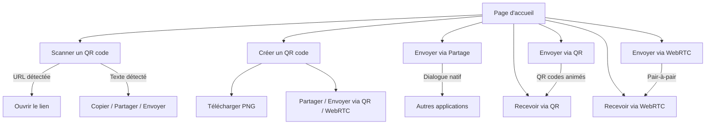
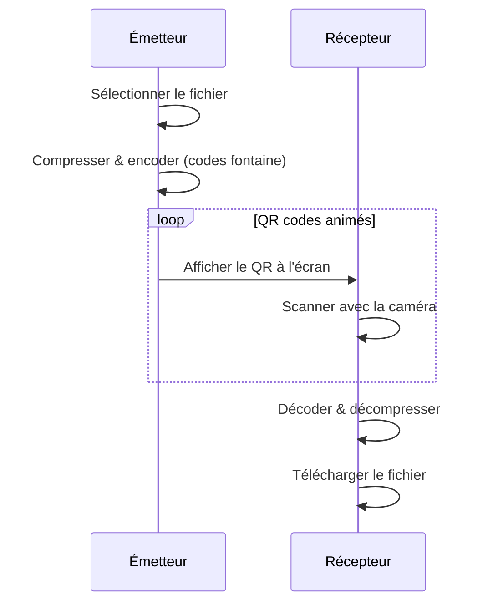
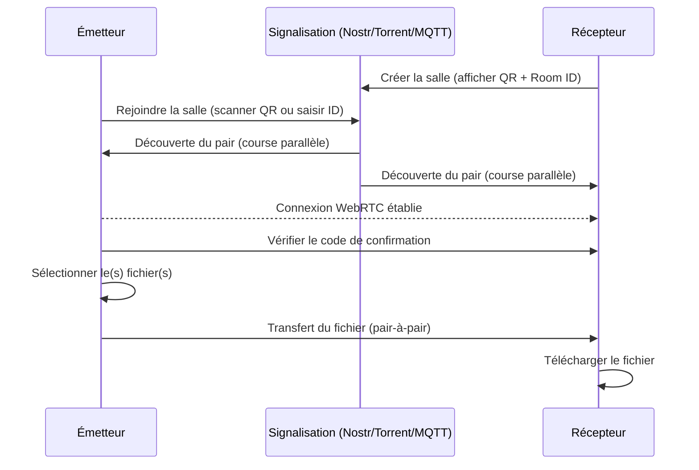

# QRShare — Guide utilisateur

## Qu'est-ce que QRShare ?

QRShare est une application web qui permet de :

1. **Scanner un QR code** avec la caméra de votre appareil
2. **Créer un QR code** à partir d'un texte ou d'une adresse web
3. **Partager un fichier** vers n'importe quelle application via le dialogue de partage natif
4. **Envoyer un fichier** à un autre appareil via des QR codes animés (sans connexion internet)
5. **Envoyer un fichier** en pair-à-pair via WebRTC (avec connexion internet)

L'application fonctionne directement dans votre navigateur, sans rien installer. Elle est accessible à l'adresse :
**https://s-celles.github.io/QRShare/**

---

## Page d'accueil

En ouvrant l'application, vous voyez deux sections :

### Outils QR (en haut)

Deux boutons pour les outils QR du quotidien :

- **Scanner un QR code** — Pour lire un QR code avec votre caméra
- **Créer un QR code** — Pour fabriquer votre propre QR code

### Transfert de fichiers (en bas)

Cinq boutons pour le transfert de fichiers entre appareils :

- **Envoyer (Partage)** — Partager des fichiers via le dialogue de partage natif (messagerie, e-mail, stockage cloud, etc.)
- **Envoyer (QR)** — Envoyer un fichier via des QR codes animés
- **Recevoir (QR)** — Recevoir un fichier en scannant les QR codes animés
- **Recevoir (WebRTC)** — Recevoir un fichier en pair-à-pair sur le réseau
- **Envoyer (WebRTC)** — Envoyer un fichier en pair-à-pair sur le réseau

---

## Scanner un QR code

1. Appuyez sur **Scanner un QR code**
2. Appuyez sur **Démarrer le scan** — votre navigateur vous demandera d'autoriser la caméra
3. Pointez la caméra vers un QR code
4. Le contenu s'affiche automatiquement :
   - Si c'est une adresse web, elle apparaît sous forme de lien cliquable
   - Sinon, le texte est affiché et vous pouvez le copier avec le bouton **Copier dans le presse-papiers**
5. Vous pouvez scanner plusieurs QR codes à la suite sans arrêter
6. Appuyez sur **Arrêter** pour arrêter la caméra

**Informations affichées** : nom de la caméra utilisée, résolution, type de code détecté. Si vous avez plusieurs caméras, un menu déroulant permet de choisir laquelle utiliser.

---

## Créer un QR code

1. Appuyez sur **Créer un QR code**
2. Tapez votre texte ou collez une adresse web dans la zone de saisie
3. Le QR code se génère instantanément et se met à jour à chaque modification
4. Ajustez les paramètres si besoin :
   - **Correction d'erreur** — Niveau de correction d'erreur (L, M, Q ou H). Plus le niveau est élevé, plus le QR code résiste aux dégradations, mais moins il peut contenir de données
   - **Version** — En mode Auto, l'application choisit la plus petite taille possible. En mode Manuel, vous choisissez une version de 1 (petit) à 40 (très grand)
5. Le compteur **Charge utile** indique combien d'octets votre texte occupe par rapport à la capacité maximale
6. Appuyez sur **Télécharger PNG** pour enregistrer le QR code comme image

Si le texte est trop long pour la version et le niveau de correction choisis, un message d'erreur s'affiche.

---

## Partager des fichiers via le partage natif

Cette méthode utilise le dialogue de partage intégré à votre navigateur pour envoyer des fichiers vers n'importe quelle application compatible (messagerie, e-mail, stockage cloud, etc.).

1. Appuyez sur **Envoyer (Partage)**
2. Déposez des fichiers ou cliquez pour parcourir et sélectionner un ou plusieurs fichiers
3. Le dialogue de partage natif s'ouvre — choisissez l'application cible
4. Le fichier est transmis à l'application sélectionnée

**Remarque :** Cette fonctionnalité nécessite un navigateur compatible avec l'API Web Share (la plupart des navigateurs mobiles et certains navigateurs de bureau). Si non supportée, un message d'erreur s'affiche.

---

## Envoyer un fichier par QR code (sans internet)

Cette méthode ne nécessite **aucune connexion internet**. Le fichier est transmis optiquement, d'écran à caméra.

**Sur l'appareil qui envoie :**
1. Appuyez sur **Envoyer (QR)**
2. Déposez un fichier ou cliquez pour en choisir un (50 Mo maximum)
3. Choisissez un mode d'encodage :
   - **Haute vitesse** — Rapide, adapté aux bonnes conditions de scan
   - **Équilibré** — Compromis entre vitesse et fiabilité
   - **Haute fiabilité** — Lent mais très fiable
4. Un QR code animé s'affiche à l'écran — ne fermez pas la page

**Sur l'appareil qui reçoit :**
1. Appuyez sur **Recevoir (QR)**
2. Appuyez sur **Démarrer le scan**
3. Pointez la caméra vers le QR code animé de l'appareil émetteur
4. La barre de progression montre l'avancement du transfert
5. Une fois terminé, le fichier se télécharge automatiquement

---

## Envoyer un fichier par WebRTC (avec internet)

Cette méthode utilise une connexion réseau mais le fichier transite directement d'appareil à appareil, sans passer par un serveur.

La découverte de pair utilise plusieurs stratégies de signalisation en parallèle (relais Nostr, trackers BitTorrent, brokers MQTT) pour une meilleure fiabilité. La première stratégie à découvrir le pair l'emporte, les autres sont annulées.

**Sur l'appareil qui reçoit :**
1. Appuyez sur **Recevoir (WebRTC)**
2. Un QR code s'affiche avec un identifiant de salle (Room ID)

**Sur l'appareil qui envoie :**
1. Appuyez sur **Envoyer (WebRTC)**
2. Scannez le QR code du récepteur ou saisissez le Room ID manuellement
3. Vérifiez que le **code de confirmation à 4 chiffres** est identique sur les deux appareils
4. Sélectionnez le(s) fichier(s) à envoyer
5. Le transfert démarre automatiquement

---

## Barre de navigation

En haut de chaque page :

- **QRShare** (à gauche) — Retour à la page d'accueil
- Bouton soleil/lune — Basculer entre thème clair et sombre
- **?** — Guide utilisateur
- **i** — Page « À propos »
- Roue dentée — Paramètres (langue, thème, paramètres WebRTC)
- **← Retour** — Retour à la page d'accueil (présent sur chaque sous-page)

---

## Paramètres WebRTC

Accès via **Paramètres → Paramètres WebRTC** (ou directement à `/#/settings/webrtc`).

### Mode de connexion

- **Parallèle** (par défaut) — Toutes les stratégies activées sont essayées simultanément. La première à établir une connexion gagne. C'est l'approche la plus rapide.
- **Séquentiel** — Les stratégies sont essayées une par une dans l'ordre configuré. En cas d'échec (timeout de 10 secondes), la suivante est essayée. Utile si vous souhaitez privilégier une stratégie spécifique.

### Stratégies de signalisation

QRShare utilise plusieurs stratégies de signalisation pour aider deux appareils à se trouver pour le transfert WebRTC :

| Stratégie | Protocole | Description |
|-----------|-----------|-------------|
| **nostr** | Relais Nostr | Réseau de relais décentralisé |
| **torrent** | Trackers BitTorrent | Protocole tracker WebTorrent |
| **mqtt** | Courtiers MQTT | Protocole de messagerie léger |

Pour chaque stratégie vous pouvez :

- **Activer/désactiver** via la case à cocher
- **Réordonner** avec les flèches haut/bas (l'ordre est important en mode séquentiel)
- **Modifier les URL des relais** (une par ligne) pour utiliser des serveurs personnalisés

Au moins une stratégie doit rester activée. Laissez les URL des relais vides pour utiliser les valeurs par défaut.

### Réinitialisation

Cliquez sur **Réinitialiser les valeurs par défaut** pour restaurer tous les paramètres WebRTC à leurs valeurs d'origine.

---

## Questions fréquentes

**L'application a-t-elle besoin d'internet ?**
Non pour le mode QR code (transfert optique). Oui pour le mode WebRTC. Les outils Scanner et Créateur fonctionnent sans internet après le premier chargement.

**Quels navigateurs sont compatibles ?**
Tout navigateur moderne (Chrome, Firefox, Safari, Edge) sur ordinateur ou mobile.

**Mes fichiers passent-ils par un serveur ?**
Non. En mode QR, le transfert est purement optique. En mode WebRTC, le fichier va directement d'un appareil à l'autre.

**Puis-je installer l'application ?**
Oui. QRShare est une Progressive Web App (PWA) : votre navigateur peut vous proposer de l'installer sur votre écran d'accueil pour un accès hors-ligne.
