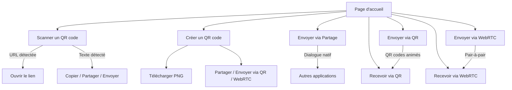
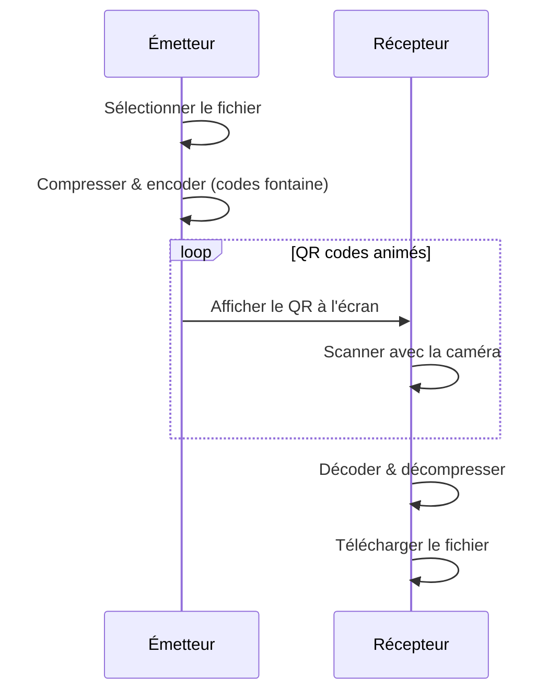
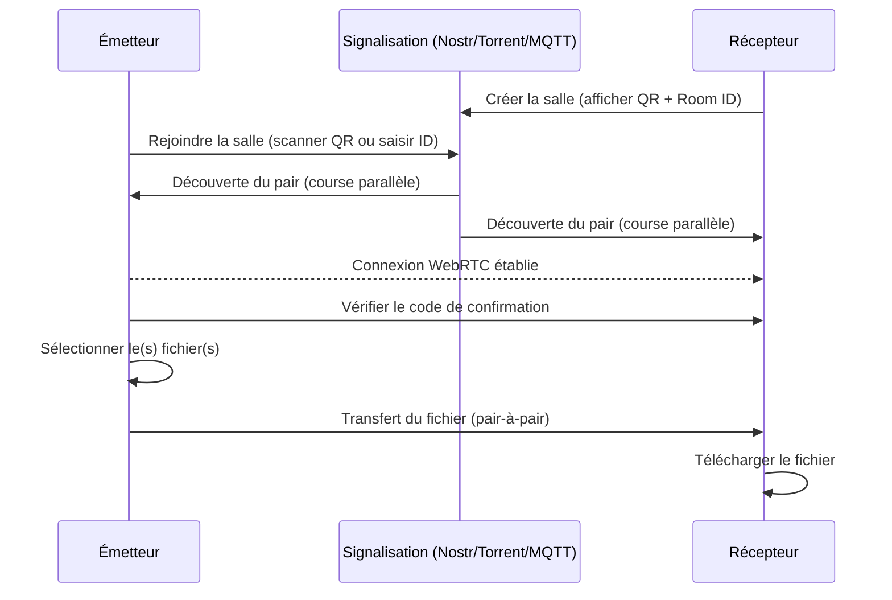

# QRShare — Guide utilisateur

## Qu'est-ce que QRShare ?

QRShare est une application web qui permet de :

1. **Scanner un QR code** avec la caméra de votre appareil
2. **Créer un QR code** à partir d'un texte ou d'une adresse web
3. **Partager un fichier ou du texte** vers n'importe quelle application via le dialogue de partage natif
4. **Envoyer un fichier ou du texte** à un autre appareil via des QR codes animés (sans connexion internet)
5. **Envoyer un fichier ou du texte** en pair-à-pair via WebRTC (avec connexion internet)

L'application fonctionne directement dans votre navigateur, sans rien installer. Elle est accessible à l'adresse :
**https://s-celles.github.io/QRShare/**


```mermaid
flowchart TD
    Accueil[Page d'accueil]
    Accueil --> Scanner[Scanner un QR code]
    Accueil --> Creer[Créer un QR code]
    Accueil --> EnvPartage[Envoyer via Partage]
    Accueil --> EnvQR[Envoyer via QR]
    Accueil --> RecQR[Recevoir via QR]
    Accueil --> EnvWR[Envoyer via WebRTC]
    Accueil --> RecWR[Recevoir via WebRTC]

    Scanner --> |URL détectée| Lien[Ouvrir le lien]
    Scanner --> |Texte détecté| Copier[Copier / Partager / Envoyer]
    Creer --> Telecharger[Télécharger PNG]
    Creer --> Partager[Partager / Envoyer via QR / WebRTC]
    EnvPartage --> |Dialogue natif| Apps[Autres applications]
    EnvQR --> |QR codes animés| RecQR
    EnvWR --> |Pair-à-pair| RecWR
```

---

## Page d'accueil

En ouvrant l'application, vous voyez deux sections :

### Outils QR (en haut)

Deux boutons pour les outils QR du quotidien :

- **Scanner un QR code** — Pour lire un QR code avec votre caméra
- **Créer un QR code** — Pour fabriquer votre propre QR code

### Transfert de fichiers (en bas)

Cinq boutons pour le transfert de fichiers entre appareils :

- **Envoyer (Partage)** — Partager des fichiers via le dialogue de partage natif (messagerie, e-mail, stockage cloud, etc.)
- **Envoyer (QR)** — Envoyer un fichier via des QR codes animés
- **Recevoir (QR)** — Recevoir un fichier en scannant les QR codes animés
- **Recevoir (WebRTC)** — Recevoir un fichier en pair-à-pair sur le réseau
- **Envoyer (WebRTC)** — Envoyer un fichier en pair-à-pair sur le réseau

---

## Scanner un QR code

1. Appuyez sur **Scanner un QR code**
2. Appuyez sur **Démarrer le scan** — votre navigateur vous demandera d'autoriser la caméra
3. Pointez la caméra vers un QR code
4. Le contenu s'affiche automatiquement :
   - Si c'est une adresse web, elle apparaît sous forme de lien cliquable
   - Sinon, le texte est affiché et vous pouvez le copier avec le bouton **Copier dans le presse-papiers**
5. Vous pouvez scanner plusieurs QR codes à la suite sans arrêter
6. Appuyez sur **Arrêter** pour arrêter la caméra

**Informations affichées** : nom de la caméra utilisée, résolution, type de code détecté. Si vous avez plusieurs caméras, un menu déroulant permet de choisir laquelle utiliser.

---

## Créer un QR code

1. Appuyez sur **Créer un QR code**
2. Tapez votre texte ou collez une adresse web dans la zone de saisie
3. Le QR code se génère instantanément et se met à jour à chaque modification
4. Ajustez les paramètres si besoin :
   - **Correction d'erreur** — Niveau de correction d'erreur (L, M, Q ou H). Plus le niveau est élevé, plus le QR code résiste aux dégradations, mais moins il peut contenir de données
   - **Version** — En mode Auto, l'application choisit la plus petite taille possible. En mode Manuel, vous choisissez une version de 1 (petit) à 40 (très grand)
5. Le compteur **Charge utile** indique combien d'octets votre texte occupe par rapport à la capacité maximale
6. Appuyez sur **Télécharger PNG** pour enregistrer le QR code comme image

Si le texte est trop long pour la version et le niveau de correction choisis, un message d'erreur s'affiche.

---

## Préparer un transfert et inviter le receveur

Ce workflow permet au donneur de préparer le contenu et d'ouvrir QRShare sur le bon écran chez le receveur avant de transmettre les données.

1. Sur l'accueil, appuyez sur **Préparer un transfert**.
2. Choisissez **Fichier** ou **Texte**, puis sélectionnez un ou plusieurs fichiers ou saisissez le texte.
3. Choisissez la politique de transfert :
   - **Hors réseau uniquement** — seuls les modes optiques (QR statique, QR animé ou CIMBAR expérimental) sont proposés. WebRTC et le partage système sont exclus, quelle que soit la taille.
   - **Privilégier le hors réseau** — un mode optique est recommandé, mais les modes réseau restent disponibles.
   - **Tous les modes** — QRShare peut notamment recommander WebRTC lorsque le contenu ne tient pas dans un QR statique.
4. Vérifiez le mode recommandé ou choisissez un autre mode autorisé. La taille n'est qu'un des critères : la politique choisie est toujours respectée.
5. Montrez d'abord le QR code d'invitation au receveur. Ce QR contient uniquement un lien vers QRShare et ouvre directement l'écran de réception correspondant ; il ne contient pas le fichier.
6. Quand le receveur est prêt, appuyez sur **Le receveur est prêt — commencer l'envoi**.

Si plusieurs fichiers sont sélectionnés, QRShare les regroupe automatiquement dans une archive ZIP de transfert, puis les extrait chez le receveur. La sélection est limitée à 50 Mo au total ; CIMBAR est proposé jusqu'à environ 33 Mo.

### Transmettre du texte par une URL

Une application peut ouvrir directement le sélecteur d'envoi avec une URL de la forme :

```text
https://s-celles.github.io/QRShare/#/send?data=Bonjour&policy=prefer-airgap
```

`data` contient le texte encodé pour une URL. `policy` accepte `airgap`, `prefer-airgap` ou `any`. En l'absence d'une politique valide, QRShare privilégie le mode hors réseau. Cette méthode convient au texte ; les fichiers ne sont pas placés dans l'URL et doivent être sélectionnés localement dans **Préparer un transfert**.

---

## Partager des fichiers via le partage natif

Cette méthode utilise le dialogue de partage intégré à votre navigateur pour envoyer des fichiers vers n'importe quelle application compatible (messagerie, e-mail, stockage cloud, etc.).

1. Appuyez sur **Envoyer (Partage)**
2. Déposez des fichiers ou cliquez pour parcourir et sélectionner un ou plusieurs fichiers
3. Le dialogue de partage natif s'ouvre — choisissez l'application cible
4. Le fichier est transmis à l'application sélectionnée

**Remarque :** Cette fonctionnalité nécessite un navigateur compatible avec l'API Web Share (la plupart des navigateurs mobiles et certains navigateurs de bureau). Si non supportée, un message d'erreur s'affiche.

---

## Envoyer un fichier par QR code (sans internet)

Cette méthode ne nécessite **aucune connexion internet**. Le fichier est transmis optiquement, d'écran à caméra.


```mermaid
sequenceDiagram
    participant E as Émetteur
    participant R as Récepteur

    E->>E: Sélectionner le fichier
    E->>E: Compresser & encoder (codes fontaine)
    loop QR codes animés
        E->>R: Afficher le QR à l'écran
        R->>R: Scanner avec la caméra
    end
    R->>R: Décoder & décompresser
    R->>R: Télécharger le fichier
```

**Sur l'appareil qui envoie :**
1. Appuyez sur **Envoyer (QR)**
2. Déposez un fichier ou cliquez pour en choisir un (50 Mo maximum)
3. Choisissez un mode d'encodage :
   - **Haute vitesse** — QR codes plus grands, adapté aux bonnes conditions de scan
   - **Équilibré** — Compromis entre capacité et fiabilité
   - **Haute fiabilité** — QR codes plus petits, très fiable
4. Un QR code animé s'affiche à l'écran — ne fermez pas la page
5. Ajustez les paramètres de transfert si nécessaire :
   - **Fréquence d'images** (1–30 FPS, par défaut : 10) — Des valeurs plus basses donnent plus de temps à la caméra pour scanner chaque image
   - **Taille de bloc** (50–1000 octets, par défaut : 250) — Des blocs plus petits produisent des QR codes plus simples, plus faciles à scanner

**Sur l'appareil qui reçoit :**
1. Appuyez sur **Recevoir (QR)**
2. Appuyez sur **Démarrer le scan**
3. Pointez la caméra vers le QR code animé de l'appareil émetteur
4. La barre de progression montre l'avancement du transfert, ainsi que le débit et le temps écoulé
5. Une fois terminé, le fichier se télécharge automatiquement

---

## Envoyer un fichier par WebRTC (avec internet)

Cette méthode utilise une connexion réseau mais le fichier transite directement d'appareil à appareil, sans passer par un serveur.

La découverte de pair utilise plusieurs stratégies de signalisation en parallèle (relais Nostr, trackers BitTorrent, brokers MQTT) pour une meilleure fiabilité. La première stratégie à découvrir le pair l'emporte, les autres sont annulées.


```mermaid
sequenceDiagram
    participant E as Émetteur
    participant Sig as Signalisation (Nostr/Torrent/MQTT)
    participant R as Récepteur

    R->>Sig: Créer la salle (afficher QR + Room ID)
    E->>Sig: Rejoindre la salle (scanner QR ou saisir ID)
    Sig->>E: Découverte du pair (course parallèle)
    Sig->>R: Découverte du pair (course parallèle)
    E-->>R: Connexion WebRTC établie
    E->>R: Vérifier le code de confirmation
    E->>E: Sélectionner le(s) fichier(s)
    E->>R: Transfert du fichier (pair-à-pair)
    R->>R: Télécharger le fichier
```

**Sur l'appareil qui reçoit :**
1. Appuyez sur **Recevoir (WebRTC)**
2. Un QR code s'affiche avec un identifiant de salle (Room ID)

**Sur l'appareil qui envoie :**
1. Appuyez sur **Envoyer (WebRTC)**
2. Scannez le QR code du récepteur ou saisissez le Room ID manuellement
3. Vérifiez que le **code de confirmation à 4 chiffres** est identique sur les deux appareils
4. Sélectionnez le(s) fichier(s) à envoyer
5. Le transfert démarre automatiquement

---

## Barre de navigation

En haut de chaque page :

- **QRShare** (à gauche) — Retour à la page d'accueil. Le numéro de version et le hash de build sont affichés à côté du titre
- Bouton soleil/lune — Basculer entre thème clair et sombre
- **?** — Guide utilisateur
- **i** — Page « À propos »
- Roue dentée — Paramètres (langue, thème, paramètres WebRTC)
- **← Retour** — Retour à la page d'accueil (présent sur chaque sous-page)

---

## Paramètres WebRTC

Accès via **Paramètres → Paramètres WebRTC** (ou directement à `/#/settings/webrtc`).

### Mode de connexion

- **Parallèle** (par défaut) — Toutes les stratégies activées sont essayées simultanément. La première à établir une connexion gagne. C'est l'approche la plus rapide.
- **Séquentiel** — Les stratégies sont essayées une par une dans l'ordre configuré. En cas d'échec (timeout de 10 secondes), la suivante est essayée. Utile si vous souhaitez privilégier une stratégie spécifique.

### Stratégies de signalisation

QRShare utilise plusieurs stratégies de signalisation pour aider deux appareils à se trouver pour le transfert WebRTC :

| Stratégie | Protocole | Description |
|-----------|-----------|-------------|
| **nostr** | Relais Nostr | Réseau de relais décentralisé |
| **torrent** | Trackers BitTorrent | Protocole tracker WebTorrent |
| **mqtt** | Courtiers MQTT | Protocole de messagerie léger |

Pour chaque stratégie vous pouvez :

- **Activer/désactiver** via la case à cocher
- **Réordonner** avec les flèches haut/bas (l'ordre est important en mode séquentiel)
- **Modifier les URL des relais** (une par ligne) pour utiliser des serveurs personnalisés

Au moins une stratégie doit rester activée. Laissez les URL des relais vides pour utiliser les valeurs par défaut.

### Réinitialisation

Cliquez sur **Réinitialiser les valeurs par défaut** pour restaurer tous les paramètres WebRTC à leurs valeurs d'origine.

---

## Export / Import des paramètres

Vous pouvez sauvegarder et restaurer tous les paramètres de QRShare (thème, langue et configuration WebRTC) via des fichiers TOML.

### Export

1. Allez dans **Paramètres**
2. Cliquez sur **Exporter les paramètres (TOML)**
3. Un fichier `qrshare-config.toml` est téléchargé

### Import

1. Allez dans **Paramètres**
2. Cliquez sur **Importer les paramètres (TOML)**
3. Sélectionnez un fichier `.toml` précédemment exporté
4. Tous les paramètres sont appliqués immédiatement

Cela permet de partager votre configuration entre appareils ou de restaurer vos paramètres après avoir effacé les données du navigateur.

---

## Transfert CIMBAR expérimental

CIMBAR est un mode optique hors réseau à haut débit utilisant des matrices de
symboles colorés. Sélectionnez **Envoyer (CIMBAR — Expérimental)** sur le donneur
et **Recevoir (CIMBAR — Expérimental)** sur le receveur. Le workflow
**Préparer un transfert** peut également générer l'invitation correspondante et
précharger le fichier côté donneur.

Le décodeur navigateur libcimbar est encore en version bêta. Utilisez une bonne
luminosité, maximisez la matrice sur l'écran et conservez le mode QR animé
standard comme solution de repli. La limite du protocole CIMBAR est d'environ
33 Mo après compression. Dès que le résultat est reconstruit, la zone caméra
disparaît et l'action de téléchargement reste affichée.

---

## Partage de messages texte

Les trois méthodes de transfert (Partage, QR, WebRTC) prennent en charge l'envoi de messages texte en plus des fichiers. En entrant dans une vue d'envoi, un bouton **Fichier / Texte** en haut permet de choisir le type de contenu.

### Envoyer du texte

1. Sélectionnez un mode d'envoi (Partage, QR ou WebRTC)
2. Basculez le sélecteur de **Fichier** à **Texte**
3. Saisissez ou collez votre message dans la zone de texte (jusqu'à 100 000 caractères)
4. Le compteur de caractères s'affiche sous la zone de saisie
5. Appuyez sur le bouton d'envoi/partage

En mode QR, un texte court est encodé dans un seul QR code. Un texte plus long utilise le même pipeline de codes fontaine que les fichiers.

### Recevoir du texte

Lorsqu'un autre appareil envoie un message texte, le récepteur le détecte automatiquement et affiche le texte directement au lieu de déclencher un téléchargement. Trois boutons d'action sont disponibles :

- **Copier dans le presse-papiers** — Copie le texte dans votre presse-papiers
- **Télécharger en fichier** — Enregistre le texte en fichier `.txt`
- **Partager** — Ouvre le dialogue de partage natif (si disponible)

### Partager du texte depuis d'autres applications

Si QRShare est installée en tant que PWA, vous pouvez partager du texte depuis d'autres applications directement vers QRShare via le menu de partage du système. QRShare s'ouvrira en mode envoi avec le texte pré-rempli.

---

## Questions fréquentes

**L'application a-t-elle besoin d'internet ?**
Non pour les modes QR code et CIMBAR (transferts optiques). Oui pour le mode WebRTC. Les outils Scanner et Créateur fonctionnent sans internet après le premier chargement.

**Quels navigateurs sont compatibles ?**
Tout navigateur moderne (Chrome, Firefox, Safari, Edge) sur ordinateur ou mobile.

**Mes fichiers passent-ils par un serveur ?**
Non. En mode QR, le transfert est purement optique. En mode WebRTC, le fichier va directement d'un appareil à l'autre.

**Puis-je installer l'application ?**
Oui. QRShare est une Progressive Web App (PWA) : votre navigateur peut vous proposer de l'installer sur votre écran d'accueil pour un accès hors-ligne.
